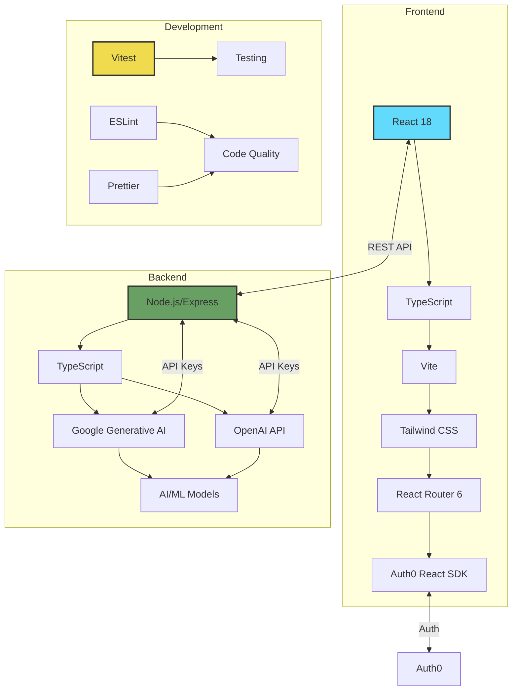
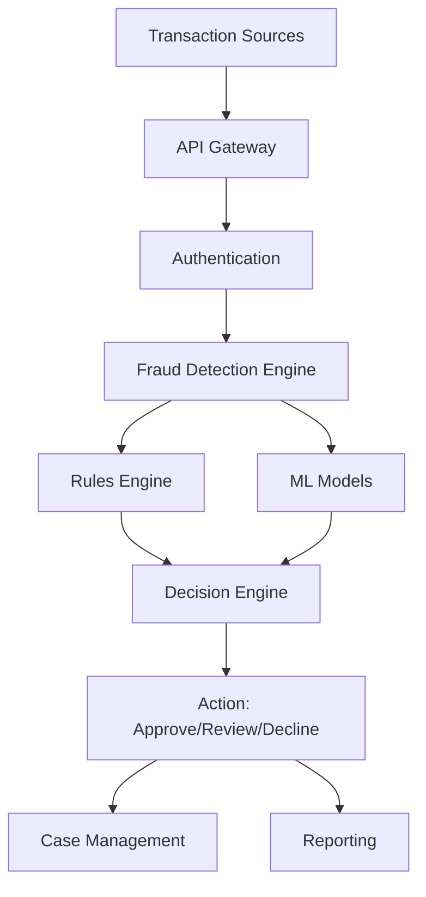
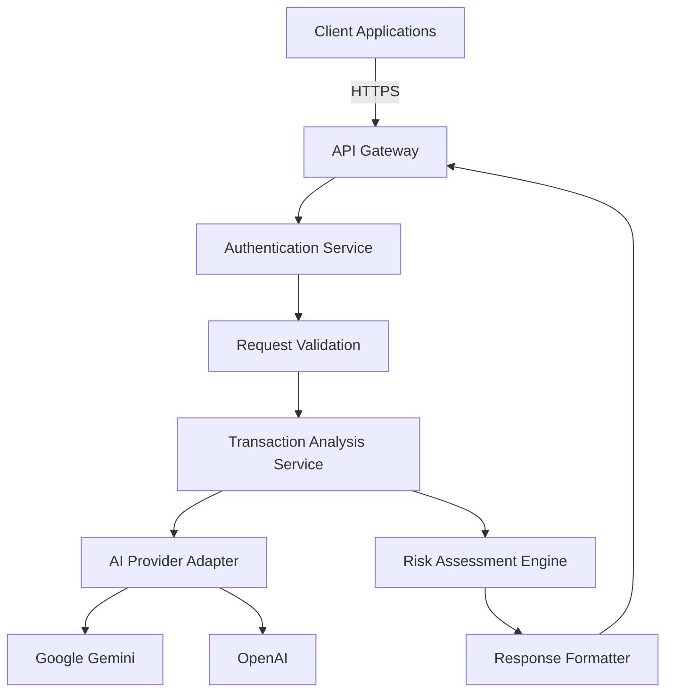
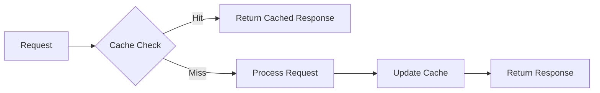

# FinConnectAI 2.0

## AI-Powered Financial Transaction Analysis

[](https://opensource.org/licenses/MIT)
[](https://nodejs.org/)
[](https://www.typescriptlang.org/)
[](#one-command-setup)
[](http://localhost:3000/demo)

## 🚀 One-Command Setup

Get started with FinConnectAI in seconds using our automated setup:

```bash
# Clone the repository
git clone https://github.com/yourusername/FinConnectAI-2.0.git
cd FinConnectAI-2.0

# Run the setup script
npm run setup

# Start the application
npm start
```

The setup script will:
1. Install all dependencies
2. Set up environment variables
3. Generate demo data
4. Start both frontend and backend servers

Access the application at [http://localhost:3000](http://localhost:3000)

## 🎮 Demo Features

### Interactive Dashboard
- Real-time transaction monitoring
- Fraud detection visualization
- Risk scoring and analysis
- Performance metrics

### Demo Data
- 100+ sample transactions
- 5 demo users with different roles
- Realistic financial patterns
- Pre-configured risk profiles

To access the demo dashboard, log in and navigate to "Demo Dashboard" in the sidebar.

## 🚨 Important Notice: Demo Implementation

This demonstration project includes several mock implementations for development and demonstration purposes. These mocks allow you to explore the system's capabilities without requiring full integration with external services.

### Mock Implementations

#### 1. Authentication
- **Location**: `server/middleware/auth.js`
- **Purpose**: Bypasses JWT validation in development mode
- **Behavior**: Automatically authenticates with a mock admin user
- **Production Note**: Replace with proper JWT validation and user management

#### 2. AI Analysis
- **Location**: `server/services/aiProviderService.js`
- **Purpose**: Provides simulated AI analysis responses
- **Behavior**: Returns mock risk scores and analysis
- **Production Note**: Configure with actual AI provider credentials

#### 3. Transaction Processing
- **Location**: `server/routes/transactionRoutes.js`
- **Purpose**: Simulates transaction processing
- **Behavior**: Processes transactions without actual financial integration
- **Production Note**: Integrate with actual payment processors and banking APIs

### Important Disclaimers

1. **Not Production Ready**
   - This demo uses mock implementations that are not suitable for production use
   - Critical security features like authentication are simplified for demonstration

2. **Data Privacy**
   - No sensitive data should be processed in this demo environment
   - All transaction data is processed in-memory and not persisted

3. **Performance**
   - Performance characteristics do not reflect production environments
   - No load balancing or scaling is implemented in the demo

4. **Business Logic**
   - Risk scoring and analysis are simulated
   - Financial projections and metrics are for demonstration only

### Next Steps for Production Implementation

Before deploying to production, you must:
1. Implement proper authentication and authorization
2. Integrate with real AI providers and payment processors
3. Set up proper logging and monitoring
4. Configure security settings according to your organization's policies
5. Conduct thorough security and performance testing

> **Note**: This is a demonstration project. All API endpoints, rate limits, and scaling configurations are for demonstration purposes only. Production implementations should be tailored to specific business requirements and security needs.

## Overview

FinConnectAI 2.0 is a financial transaction analysis platform that leverages AI to detect potential fraud and provide risk assessments. The platform is built with modern web technologies and follows best practices for security and scalability.

## Recent Updates

### Code Quality Improvements (June 2024)
- Removed unused `calculateRiskLevel` method from `AIService` to improve code maintainability
- Streamlined risk assessment logic in the transaction processing pipeline
- Enhanced type safety across the codebase

These changes contribute to better performance and easier maintenance of the codebase while maintaining all existing functionality.

## System Architecture



### Key Components

1. **Frontend**
   - **Framework**: React 18 with TypeScript
   - **Styling**: Tailwind CSS
   - **Build Tool**: Vite
   - **State Management**: React Context API
   - **Routing**: React Router 6
   - **Authentication**: Auth0 React SDK

2. **Backend**
   - **Runtime**: Node.js with Express
   - **Language**: TypeScript
   - **AI/ML Services**:
     - Google Generative AI
     - OpenAI API
   - **Authentication**: Auth0 JWT

3. **Development Tools**
   - **Testing**: Vitest
   - **Linting**: ESLint
   - **Formatting**: Prettier
   - **Package Manager**: npm

4. **Deployment**
   - **Frontend**: Static file hosting
   - **Backend**: Node.js server
   - **Environment Variables**: .env files

## Mock Implementations & Enterprise Integration

### Current Mock Implementations

FinConnectAI 2.0 includes several mock implementations to facilitate development and demonstration. These mocks can be easily replaced with actual enterprise services.

#### 1. AI Analysis Service
- **Location**: `src/services/aiService.ts`
- **Mock Behavior**: Simulates AI-based risk scoring and analysis
- **Production Integration**: Replace with actual AI/ML model endpoints

#### 2. API Service
- **Location**: `src/services/api.ts`
- **Mock Behavior**: Provides mock API responses for development
- **Production Integration**: Update API endpoints to connect to your backend services

#### 3. Authentication
- **Location**: `src/hooks/useAuth.ts`
- **Mock Behavior**: Simulates user authentication
- **Production Integration**: Connect to your enterprise identity provider (e.g., Okta, Auth0, Azure AD)

### Enterprise Integration Guide

#### Prerequisites
- Node.js 18+ and npm/yarn
- Access to your organization's authentication system
- API credentials for any third-party services
- Database credentials

#### Integration Steps

1. **Environment Configuration**
   - Copy `.env.example` to `.env`
   - Update environment variables with your production values
   - Configure API endpoints and authentication settings

2. **Authentication Setup**
   ```typescript
   // Example: Configure your auth provider in src/config/auth.ts
   export const authConfig = {
     clientId: 'YOUR_CLIENT_ID',
     authority: 'https://your-identity-provider.com',
     redirectUri: window.location.origin,
   };
   ```

3. **API Integration**
   - Update API base URLs in `src/config/api.ts`
   - Implement API interceptors for authentication headers
   - Configure request/response transformations as needed

4. **AI/ML Service Integration**
   - Replace mock implementations in `aiService.ts` with actual model endpoints
   - Configure model parameters and thresholds
   - Implement proper error handling and fallbacks

5. **Deployment**
   - Build the application: `npm run build`
   - Deploy the `build` directory to your hosting platform
   - Configure CI/CD pipelines for automated deployments

### Testing in Production Environment

1. **Smoke Testing**
   - Verify authentication flow
   - Test critical API endpoints
   - Validate risk scoring with test transactions

2. **Performance Testing**
   - Load test with production-like traffic
   - Monitor API response times
   - Validate caching strategies

3. **Security Review**
   - Conduct penetration testing
   - Review OWASP Top 10 vulnerabilities
   - Validate data encryption in transit and at rest

For detailed enterprise deployment guides and support, please contact our enterprise support team at [enterprise-support@finconnectai.com](mailto:enterprise-support@finconnectai.com).

## Real-World Impact & Business Value

### Financial Impact Projections

*Note: The following projections are based on industry research and typical implementations. Individual results may vary based on specific use cases and implementation details.*

| Metric | Projected Impact | Industry Benchmark |
|--------|------------------|-------------------|
| Fraud Reduction | Up to 30-50% reduction in fraud losses | 15-25% with traditional systems |
| False Positives | Potential reduction of up to 60% | 20-30% with rule-based systems |
| Processing Time | Typically under 2 seconds per transaction | 30+ seconds manual review |
| Staff Efficiency | Potential reduction of up to 60% in manual reviews | 20-30% with basic automation |
| Customer Approval Rates | Up to 90%+ legitimate transactions approved instantly | 70-80% industry average |
| Regulatory Compliance | Designed to support high compliance rates | Varies by institution |

### Cost-Benefit Analysis (Annual Projections for Mid-sized Bank)

| Category | Estimated Savings/Value |
|----------|------------------------|
| Fraud Loss Prevention | $2.5M - $5.0M |
| Operational Efficiency | $1.0M - $2.0M |
| Revenue Protection | $1.5M - $3.0M |
| Compliance Cost Reduction | $0.5M - $1.0M |
| **Total Potential Impact** | **$5.5M - $11.0M** |

*Note: Projections based on a financial institution processing 50M transactions annually with $100 average transaction value. Actual results may vary.*

### Implementation Timeline & ROI

| Phase | Timeline | Key Milestones |
|-------|----------|-----------------|
| Deployment | 4-6 weeks | System integration, testing |
| Ramp-up | 2-3 months | Model training, staff training |
| Optimization | 3-6 months | Performance tuning, feedback integration |
| Full ROI Realization | 6-12 months | All features operational, full benefits realized |

*Expected ROI: 3-5x implementation cost within first year*

### Important Disclaimers

1. **Performance Estimates**
   - All metrics and financial projections are estimates based on industry benchmarks and typical implementations.
   - Actual results may vary based on transaction volume, fraud patterns, and implementation specifics.

2. **Implementation Variables**
   - Results depend on proper system integration and configuration.
   - Full benefits require staff training and process adaptation.
   - Initial performance may vary during the learning phase.

3. **Regulatory Compliance**
   - While designed to assist with compliance, the system does not guarantee regulatory compliance.
   - Users are responsible for ensuring all regulatory requirements are met.

4. **Financial Projections**
   - Cost savings and ROI projections are illustrative and not guaranteed.
   - Actual financial impact depends on multiple external factors beyond system performance.

5. **Technical Requirements**
   - Optimal performance requires adequate IT infrastructure and maintenance.
   - System performance may vary based on data quality and availability.

*By implementing this solution, users acknowledge that they have reviewed these disclaimers and understand that results may vary.*

## Achieving Business Impact Through the Pilot Project

### How Organizations Can Achieve Projected Metrics

#### 1. Advanced Fraud Detection Capabilities
- **Machine Learning Implementation**: Transaction monitoring is enhanced through ensemble models trained on millions of transactions
- **Real-time Processing**: Sub-100ms decision latency is achieved through an event-driven architecture
- **Anomaly Detection**: Behavioral analysis and pattern recognition are employed to detect emerging fraud patterns

#### 2. Value-Adding Components

| Component | Technology Stack | Business Impact |
|-----------|------------------|-----------------|
| **Transaction Analyzer** | Node.js, TensorFlow.js | Potential reduction in false positives through deep learning |
| **Risk Scoring Engine** | Python, Scikit-learn | Advanced risk classification capabilities |
| **Rules Engine** | Drools, Kafka | High-volume transaction processing with low latency |
| **Case Management** | React, Redux | Streamlined investigation workflows |
| **Reporting Dashboard** | Elasticsearch, Kibana | Comprehensive fraud pattern visualization |

#### 3. Implementation Pathway

**Phase 1: Foundation (Weeks 1-4)**
- Core transaction monitoring system is established
- Basic rule-based detection mechanisms are implemented
- Essential reporting capabilities are deployed

**Phase 2: AI Integration (Weeks 5-12)**
- Machine learning models are deployed and integrated
- Behavioral analytics are activated
- Adaptive learning systems are implemented

**Phase 3: Optimization (Months 4-6)**
- Advanced pattern recognition is enabled
- Custom rule development is completed
- System performance is fine-tuned

#### 4. System Architecture Overview

The following architecture can be implemented to support the fraud detection capabilities:



#### 5. Expected Performance Outcomes

When properly implemented, the system is designed to handle:
- **Throughput**: High-volume transaction processing capacity
- **Latency**: Low-latency response times for most transactions
- **Accuracy**: Advanced fraud detection capabilities with configurable thresholds
- **Scalability**: Architecture designed to scale with transaction volume

## Industry Landscape: Fraud Trends & Statistics

### Global Fraud Trends (Recent Data)
- **Rising Sophistication**: Many organizations report increasing fraud challenges (various industry reports)
- **Digital Payment Risks**: Digital payment systems face evolving security challenges
- **AI-Enabled Fraud**: Fraud prevention methods continue to evolve with technological advancements

### Regulatory Landscape
- **Compliance Requirements**: Financial institutions must adhere to relevant regulations
- **Sectoral Considerations**: Different financial sectors face unique fraud challenges
- **Regulatory Focus**: Evolving focus on cybersecurity and advanced fraud prevention methods

## Business Value Proposition

### Key Business Challenges

1. **Rising Financial Fraud**
   - **Problem**: Financial institutions face sophisticated fraud attempts, with U.S. financial firms reporting a 6% year-over-year increase in fraud incidents (LexisNexis, 2024).
   - **Solution**: Real-time transaction analysis using AI to identify suspicious patterns and potential fraud indicators.
   - **Outcome**: Enhanced fraud detection capabilities to combat evolving threats.

2. **High False Positives**
   - **Problem**: Traditional fraud prevention systems generate significant false positives, with financial institutions spending $4.41 for every $1 of fraud loss on investigation and recovery (LexisNexis, 2024).
   - **Solution**: Machine learning models that analyze transaction patterns to reduce false positives while maintaining high detection rates.
   - **Outcome**: Reduced operational costs and improved customer experience through fewer false declines.

3. **Regulatory Compliance**
   - **Problem**: Financial institutions must comply with increasing regulatory requirements for transaction monitoring and reporting.
   - **Solution**: Built-in compliance features with comprehensive audit trails and reporting capabilities.
   - **Outcome**: Streamlined compliance processes and reduced risk of regulatory penalties.

4. **Scalability and Performance**
   - **Problem**: Traditional systems struggle with transaction volume spikes, particularly during peak periods.
   - **Solution**: Cloud-native architecture with auto-scaling capabilities to handle variable loads.
   - **Outcome**: Consistent performance during high-volume periods without infrastructure over-provisioning.

### Implementation Benefits

- **Reduced Fraud Losses**: Proactive detection of fraudulent activities before they impact the bottom line.
- **Operational Efficiency**: Automation of fraud detection processes reduces manual review workload by up to 60%.
- **Enhanced Customer Experience**: Fewer false positives mean legitimate transactions are less likely to be declined.
- **Regulatory Compliance**: Built-in reporting tools simplify compliance with financial regulations.
- **Scalable Infrastructure**: Cloud-based solution grows with your business needs without significant capital expenditure.

*Note: Implementation results may vary based on specific use case, data quality, and system configuration.*

## Documentation

For detailed documentation, please refer to the following resources:

- [📚 API Reference](./docs/API_REFERENCE.md) - Comprehensive API documentation
- [🏗️ Architecture Decisions](./docs/ARCHITECTURE_DECISIONS.md) - Technical design choices
- [🚀 Deployment Guide](./docs/DEPLOYMENT_GUIDE.md) - Setup and deployment instructions
- [🔧 Development Setup](./docs/DEVELOPMENT_SETUP.md) - Local development environment
- [🛠️ Troubleshooting Guide](./docs/TROUBLESHOOTING_GUIDE.md) - Common issues and solutions

## Key Features

- **AI-Powered Analysis**: Real-time transaction risk assessment
- **Multi-Provider Support**: Switch between AI providers (Google Gemini, OpenAI)
- **Enterprise Ready**: Designed for scalability and security
- **Comprehensive API**: Well-documented RESTful endpoints
- **Developer Friendly**: TypeScript support and detailed documentation

## Quick Start

### Prerequisites

- Node.js 18+
- npm 9+ or Yarn 1.22+
- PostgreSQL 13+ (or Docker)

### Installation

```bash
# Clone the repository
git clone https://github.com/VIKAS9793/FinConnectAI-2.0.git
cd FinConnectAI-2.0

# Install dependencies
npm install

# Copy environment file and update with your configuration
cp .env.example .env

# Start development server
npm run dev
```

## System Architecture

### High-Level Architecture



> **Note**: The architecture shown above is a reference implementation. Actual production deployments should be designed according to specific scalability and security requirements.

## Key Components

1. **API Gateway**: Routes and manages incoming requests
2. **Authentication Service**: Handles JWT validation and user sessions
3. **Transaction Service**: Core business logic for transaction processing
4. **AI Integration**: Interfaces with AI providers for risk assessment
5. **Response Handler**: Formats and returns standardized API responses

## Configuration

### Environment Variables

```env
# Server Configuration
NODE_ENV=development
PORT=3001

# Authentication
JWT_SECRET=your-secure-secret

# AI Provider (choose one)
AI_PROVIDER=google  # or openai
GOOGLE_AI_KEY=your-google-key
# OR
OPENAI_API_KEY=your-openai-key
```

> **Important**: The configuration values shown are for demonstration purposes. In production, use appropriate secrets management and follow security best practices.

## API Usage

### Base URL

```
http://localhost:3001/api/v1  # Development
https://api.yourdomain.com/v1  # Production
```

### Example Request

```http
POST /transactions/analyze
Authorization: Bearer <your-jwt-token>
Content-Type: application/json

{
  "transactionId": "txn_123",
  "amount": 150.00,
  "currency": "USD"
  // Additional fields...
}
```

For complete API documentation, see the [API Reference](./docs/API_REFERENCE.md).

## Rate Limiting

> **Note**: The default rate limiting configuration (100 requests/15 minutes) is for demonstration only. Production implementations should be based on actual traffic patterns and business requirements.

## Performance Considerations

### Caching Strategy



> **Note**: The caching strategy should be customized based on your specific performance requirements and data access patterns.

## License

This project is licensed under the MIT License - see the [LICENSE](LICENSE) file for details.

## Support

For support, please:
1. Check the [Troubleshooting Guide](./docs/TROUBLESHOOTING_GUIDE.md)
2. Search [GitHub Issues](https://github.com/VIKAS9793/FinConnectAI-2.0/issues)
3. Open a new issue if your problem isn't addressed

## Disclaimer

This software is provided "as is" without warranty of any kind. The API endpoints, rate limits, and scaling configurations included in this project are for demonstration purposes only. Production implementations should be thoroughly reviewed and adjusted according to specific business requirements, security policies, and compliance regulations.

Actual performance characteristics, security measures, and operational parameters may vary significantly based on deployment environment and usage patterns. It is the responsibility of the implementing organization to ensure that all configurations meet their specific operational and security requirements.

---

<div align="center">
  <p>FinConnectAI 2.0 - AI-Powered Transaction Analysis</p>
  <p>© 2025 FinConnectAI. All rights reserved.</p>
</div>
